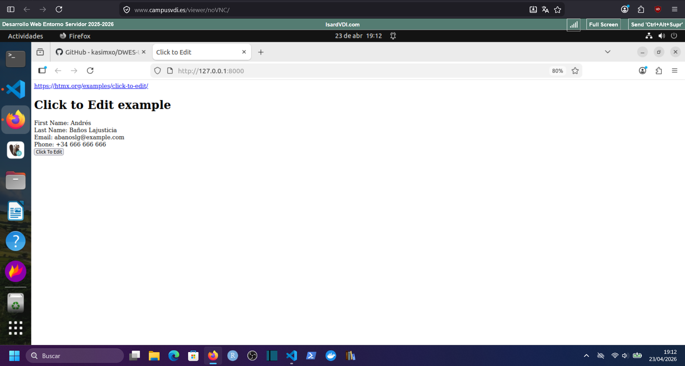
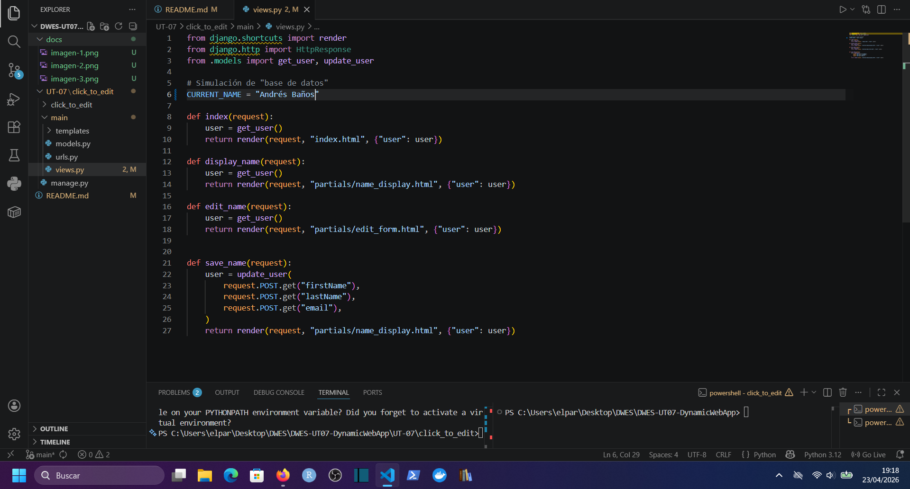
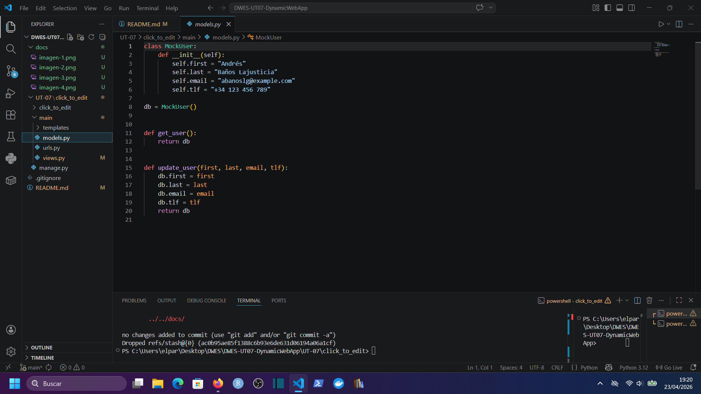
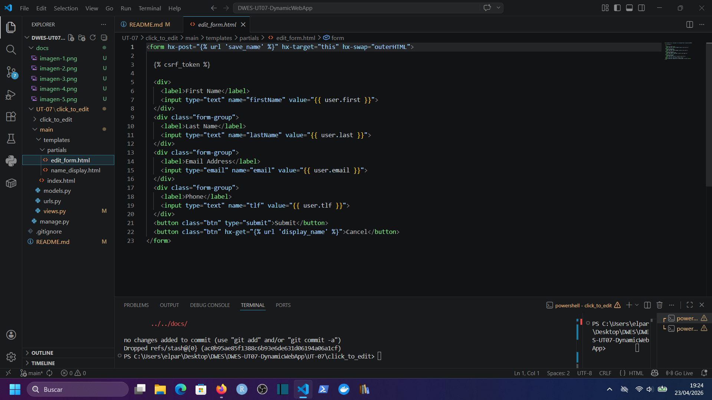
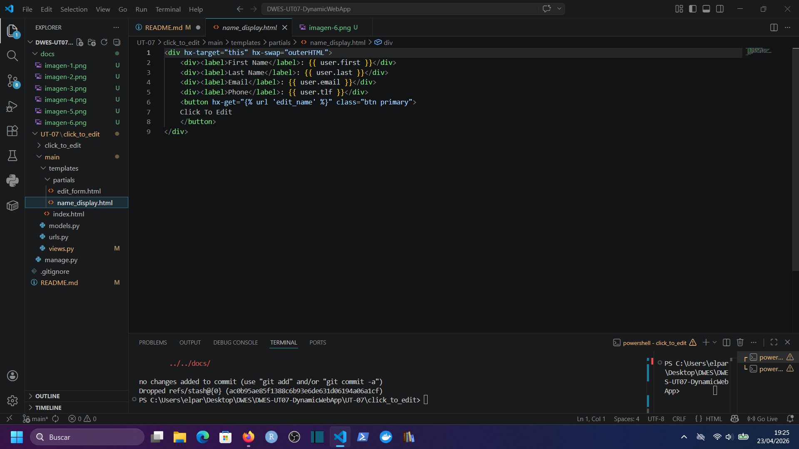

# DWES UT07 Dynamic Web App

*_Nota: La aplicación base se ha extraído de https://github.com/sync-david/curso-dwes/tree/main/UT-07/_

## Ejecución de la aplicación

Al acceder a la aplicación se cargan los datos del usuario por defecto:

Podemos modificar cualquiera de los campos del formulario, incluyendo el número de teléfono, basta con hacer clic en "Click to Edit".

Una vez estamos satisfechos con los cambios, pulsamos el botón "Submit" y se guardan automáticamente.

## Modificaciones

Se han realizado las modificaciones mínimas necesarias para cumplir con los requisitos de la tarea:

- En el archivo views.py se ha modificado la función de guardado para que recoja el nuevo campo de teléfono.

- En el archivo models.py se ha incluido el nuevo campo de número de teléfono tanto en el usuario de ejemplo como en la función de update user.

- En el archivo edit_form.html se ha incluido un nuevo input para el número de teléfono.

- En el archivo name_display.html se ha incluido una nueva etiqueta para poder mostrar el número de teléfono del usuario

